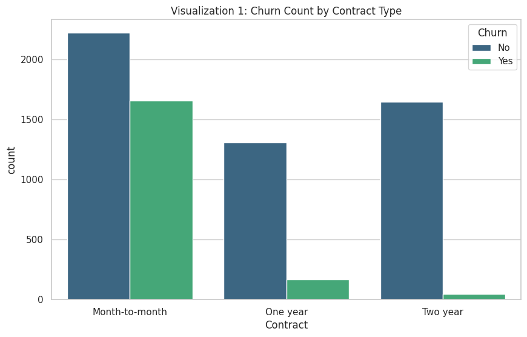
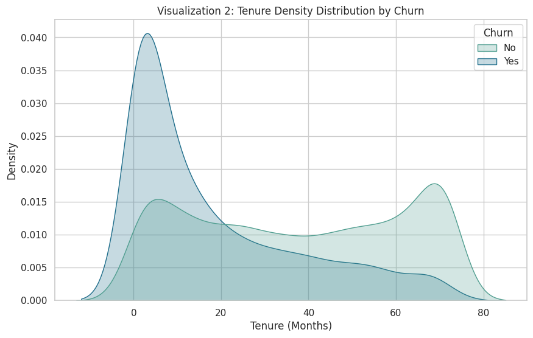
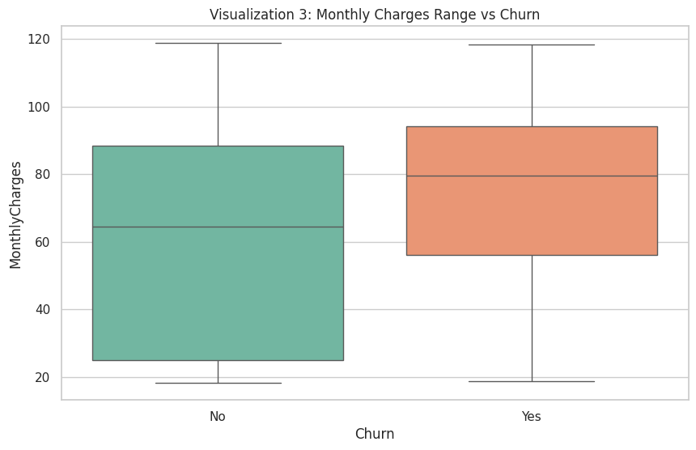
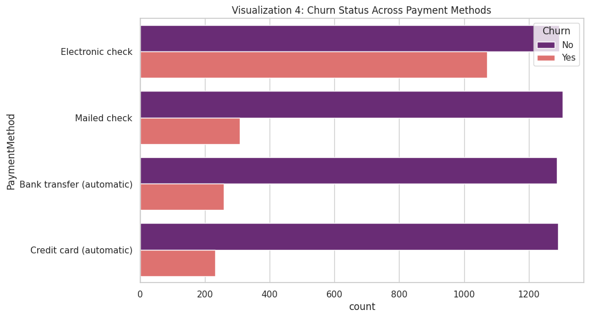
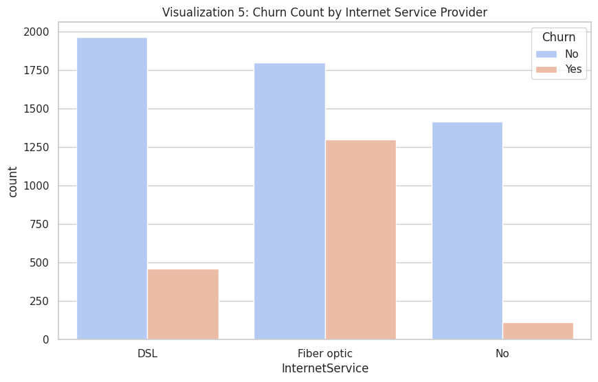
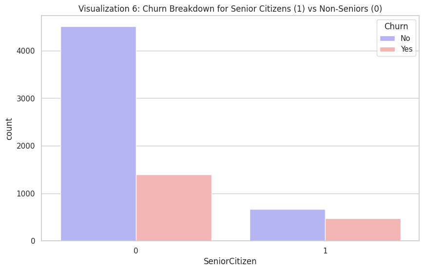
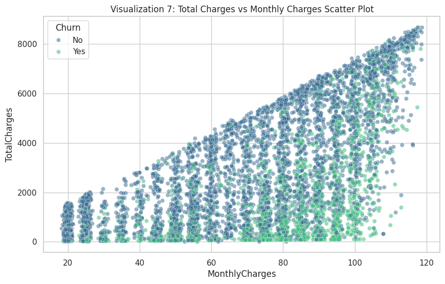

# Customer Churn Prediction Project - NexAfrica ML Internship

## 🏢 1. Business Understanding & Problem Statement (Week 1)
* **What is Customer Churn?** Customer churn represents the business scenario where an existing consumer or subscriber cancels their relationship with a service provider.
* **Business Importance:** Retaining current consumers is significantly cheaper than standard customer acquisition. High churn erodes profitability and signals issues within pricing models or product-market fit.
* **Goal of the Prediction Model:** To construct a robust binary classification model that accurately predicts individual customer churn probabilities based on account histories, tech configurations, and demographic indicators.
* **Business Utility:** Proactively flags accounts at high risk of departure, allowing customer retention units to intercept them with targeted promotions, service improvements, or contract incentives.

---

## 📊 2. Data Dictionary & Variable Schema
Verified layout across all features in the dataset:

| Feature | Description | Variable Type |
| :--- | :--- | :--- |
| **customerID** | Unique identifier | Categorical |
| **gender** | Consumer gender demographic | Categorical |
| **SeniorCitizen** | Indicator if customer is elderly (1, 0) | Numerical (Binary) |
| **Partner** | Marital status indicator (Yes/No) | Categorical |
| **Dependents** | Family dependency status indicator (Yes/No) | Categorical |
| **tenure** | Total active account age in months | Numerical |
| **PhoneService** | Subscription to telephone features (Yes/No) | Categorical |
| **MultipleLines** | Subscription to secondary telephone lines | Categorical |
| **InternetService** | Internet connectivity technology (DSL, Fiber, No) | Categorical |
| **OnlineSecurity** | Supplemental safety subscription | Categorical |
| **OnlineBackup** | Cloud infrastructure backup subscription | Categorical |
| **DeviceProtection** | Physical device coverage plan status | Categorical |
| **TechSupport** | Premium maintenance line enrollment status | Categorical |
| **StreamingTV** | Multi-media television streaming service status | Categorical |
| **StreamingMovies** | Multi-media cinematic streaming service status | Categorical |
| **Contract** | Customer billing structural duration terms | Categorical |
| **PaperlessBilling** | Statement configuration choice (Yes/No) | Categorical |
| **PaymentMethod** | Customer transaction processing pipeline selection | Categorical |
| **MonthlyCharges** | Regularized standard monthly customer invoice cost | Numerical |
| **TotalCharges** | Net lifetime financial value billed | Numerical |
| **Churn** | **[TARGET]** Label detailing active/left statuses | Target (Binary) |

---

## 🛠️ 3. Data Quality & Cleaning Report
* **Initial Profile:** 7,043 rows, 21 columns.
* **Duplicate Counts:** 0 duplicate customer rows discovered.
* **Data Type Fixes:** `TotalCharges` was corrected from its text classification (`object`) back into standard float values. Empty whitespaces (`" "`) belonging to 11 brand-new customers with a tenure of 0 were converted to `NaN` elements and safely filled with `0.0`.

---

## 🎯 4. Target Variable Distribution Profile
* **Class 'No' (Retained Users):** 5,174 customers (73.46%)
* **Class 'Yes' (Churned Users):** 1,869 customers (26.54%)
* **Technical Takeaway:** Due to this ~73/27 class imbalance, pure accuracy scores will yield a false sense of model performance. We must actively prioritize optimization around **Recall** and **F1-Score** during subsequent machine learning training loops.

---

## 📈 5. Exploratory Data Analysis & Key Insights (Week 2)

### 🔍 5 Key Churn Drivers Discovered:
1. **Contract Vulnerability:** Month-to-month contracts contain the highest churn density, whereas 1 and 2-year contracts keep accounts stable.
2. **Tenure Lifespan Risk:** Churn peaks drastically during the first few months of tenure (0-5 months), highlighting a fragile early customer retention window.
3. **Premium Pricing Friction:** Churned users show significantly elevated monthly charges compared to customers who stay.
4. **Payment Method Obstacles:** Customers utilizing an **Electronic check** option showcase an exceptionally high likelihood of leaving compared to automated bank transfers or credit cards.
5. **Infrastructure Upgrades:** **Fiber optic** accounts churn at a much higher frequency than older DSL hookups, displaying potential customer onboarding or service issues.

### 🖼️ Complete Project Exploratory Visualizations

#### Visualization 1: Churn Count by Contract Type

#### Visualization 2: Tenure Density Distribution by Churn

#### Visualization 3: Monthly Charges Range vs Churn

#### Visualization 4: Churn Status Across Payment Methods

#### Visualization 5: Churn Count by Internet Service Provider

#### Visualization 6: Churn Breakdown for Senior Citizens

#### Visualization 7: Total Charges vs Monthly Charges Scatter Plot

---

## ⚙️ 6. Feature Engineering Log
To optimize future machine learning performance, three key features were designed and constructed:
* **TenureGroup:** Binned continuous monthly tenure values into actionable business tiers (`0-1 Year`, `1-2 Years`, `2-4 Years`, `Over 4 Years`).
* **TotalServices:** A collective integer counter mapping out the net volume of auxiliary services an account has active (combining online security, backup, streaming, tech support, etc.).
* **CostPerMonthOfTenure:** A financial strain metric (`MonthlyCharges / (tenure + 1)`) highlighting premium pricing shocks on newer accounts.

* **Final ML-Ready Preprocessed Shape:** (7043 rows, 36 columns) following target mapping and multi-class One-Hot Encoding (`pd.get_dummies`).

🔗 **Raw Dataset Link:** [Kaggle Telco Customer Churn Dataset](https://www.kaggle.com/datasets/blastchar/telco-customer-churn)

